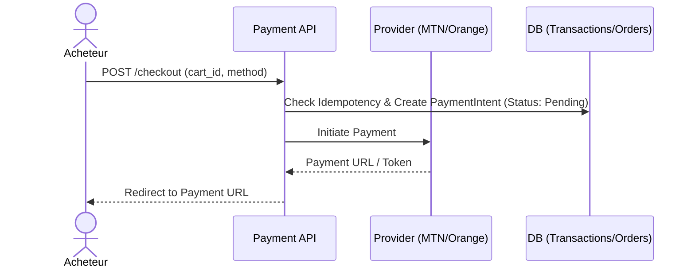
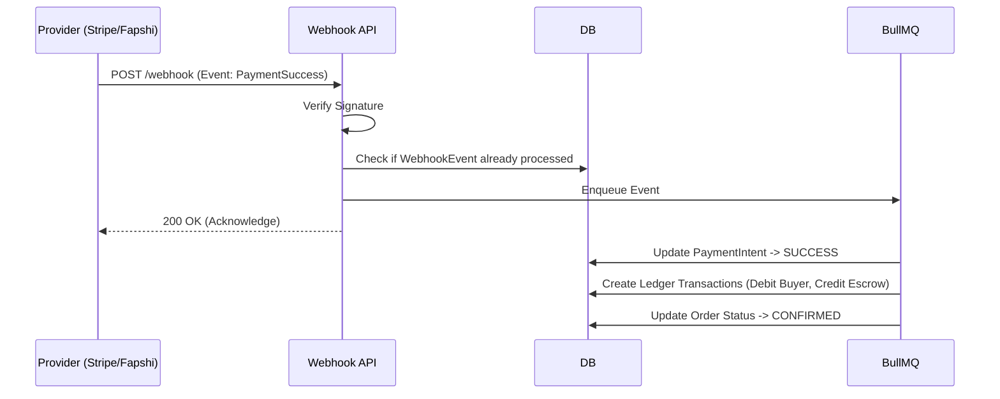

# VISUALIZ - FINANCIAL ENTERPRISE ARCHITECTURE

## 1. ANALYSE DU SYSTÈME ACTUEL & LIMITES
**Actuel :**
- Le système de paiement (Fapshi) est couplé au code des routes Express (`server/routes/payments.ts`).
- Les paiements mettent à jour la table `orders` directement.
- Absence de journalisation en partie double (Double-Entry Ledger) pour garantir l'intégrité comptable.
- Absence d'abstraction des fournisseurs de paiement (Payment Providers).
- Absence de moteur de webhooks robuste (pas d'idempotence, pas de retry, pas de vérification de signature forte standardisée).

**Objectif :**
Passer à une architecture modulaire, auditable, idempotente et préparée pour l'Escrow (séquestre) et de multiples passerelles de paiement (MTN, Orange, Stripe, PayPal, etc.).

---

## 2. ARCHITECTURE FINANCIÈRE PROPOSÉE (CLEAN ARCHITECTURE)

L'architecture repose sur des principes de systèmes distribués financiers :

1. **Payment Gateway Abstraction Layer** : Une interface commune `IPaymentProvider` que chaque fournisseur (Stripe, Fapshi, Flutterwave) implémente.
2. **Double-Entry Accounting (Registre Comptable)** : Toute opération financière génère au minimum deux écritures (Débit/Crédit) dans un grand livre (Ledger).
3. **Idempotency Engine** : Chaque requête de paiement ou webhook possède une `idempotency_key` (UUID) pour éviter les doubles facturations.
4. **State Machine (Machine à États)** : Les paiements, commandes, et retraits suivent un cycle de vie strict.
5. **Escrow Ready** : Les fonds entrants vont sur un compte "Platform Liability" (Wallet bloqué) avant d'être transférés vers le "Seller Available Wallet" à la livraison.

### Modules Backend :
- `Payments` : Gestion des sessions de checkout et routage vers les providers.
- `Wallets` : Gestion des soldes (disponible, bloqué).
- `Transactions` : Le Ledger (grand livre comptable).
- `Webhooks` : Ingestion, validation, et traitement asynchrone des événements externes.
- `Invoices` : Génération et stockage des factures.

---

## 3. WORKFLOWS FINANCIERS

### 3.1. Workflow de Paiement de Commande (Checkout)


### 3.2. Traitement des Webhooks (Asynchrone & Idempotent)


### 3.3. Workflow de Retrait (Payout)
1. **Demande** : Vendeur demande un retrait de 500k.
2. **Lock** : Le montant est déduit de `available_balance` et ajouté à `locked_balance`.
3. **Validation Auto (Rules Engine)** : Si < 1M et pas de fraude suspectée -> OK.
4. **Validation Manuelle** : Si > 1M, nécessite approbation Comptable.
5. **Exécution** : Appel API au Provider pour le transfert.
6. **Confirmation** : Au succès du webhook de Payout, le `locked_balance` est vidé.

---

## 4. DESIGN DES TRANSACTIONS (DOUBLE-ENTRY LEDGER)

Toute transaction financière génère des entrées `transactions` liées à un `reference_id` (Order, Payout, Refund).

**Entités principales :**
- `payment_intents` : Suit l'état d'une tentative de paiement.
- `wallets` : `id`, `owner_id`, `owner_type` (user, company, platform), `currency`, `available_balance`, `escrow_balance`.
- `transactions` : `id`, `wallet_id`, `type` (CREDIT, DEBIT), `amount`, `currency`, `purpose` (PAYMENT, COMMISSION, PAYOUT, REFUND), `reference_type`, `reference_id`, `status`.

**Exemple d'une vente de 100k (Commission 5%) :**
1. Crédit Wallet Acheteur : +100k (Dépôt technique)
2. Débit Wallet Acheteur : -100k (Achat)
3. Crédit Wallet Plateforme (Escrow) : +100k (Fonds sécurisés)
*-- À la livraison (Escrow Release) --*
4. Débit Wallet Plateforme (Escrow) : -100k
5. Crédit Wallet Vendeur : +95k (Revenu net)
6. Crédit Wallet Plateforme (Commission) : +5k (Revenu plateforme)

---

## 5. MOTEUR DE WEBHOOKS & SÉCURITÉ

1. **Validation Signature** : HMAC SHA-256 avec le secret du provider.
2. **Replay Protection** : Vérification du `timestamp` du webhook (rejet si > 5 min) et unicité de l'`event_id`.
3. **Idempotence** : Utilisation d'une table `webhook_logs` avec `provider_event_id` en contrainte UNIQUE. Si l'événement existe déjà avec le statut `processed`, on renvoie 200 OK sans rien faire.
4. **Retry Pattern** : Si l'événement échoue (erreur réseau, DB lock), il reste en statut `failed` et BullMQ le re-tente exponentiellement.

---

## 6. MOTEUR DE FRAUDE (FRAUD DETECTION ENGINE)

Un module s'exécutant avant la création du `PaymentIntent` et lors des demandes de retrait :
- **Velocity Checks** : > N paiements échoués en 1h.
- **IP Analysis** : IP différente du pays de livraison/inscription.
- **Amount Thresholds** : Commandes dépassant 5x le panier moyen habituel.
Action : Flag `review_required` ou `rejected`.

---

## 7. PROPOSITIONS DE MIGRATION (DATABASE SCHEMA)

```sql
-- Nouvelles tables nécessaires pour l'Enterprise Architecture

-- Payment Methods (Stripe, Fapshi, etc.)
CREATE TABLE payment_providers (
    id UUID PRIMARY KEY,
    name VARCHAR(50) NOT NULL,
    is_active BOOLEAN DEFAULT true,
    config JSONB -- Keys will be managed in Vault/ENV in production
);

-- Payment Intents (Tracks the payment session)
CREATE TABLE payment_intents (
    id UUID PRIMARY KEY,
    order_id UUID REFERENCES orders(id),
    provider_id UUID REFERENCES payment_providers(id),
    amount DECIMAL NOT NULL,
    currency VARCHAR(3) DEFAULT 'XAF',
    status VARCHAR(20) NOT NULL, -- pending, requires_action, succeeded, failed, canceled
    provider_transaction_id VARCHAR(100),
    idempotency_key UUID UNIQUE,
    created_at TIMESTAMP DEFAULT NOW()
);

-- Ledger Transactions
CREATE TABLE ledger_transactions (
    id UUID PRIMARY KEY,
    wallet_id UUID REFERENCES wallets(id),
    type VARCHAR(10) NOT NULL, -- CREDIT, DEBIT
    purpose VARCHAR(20) NOT NULL, -- PAYMENT, REFUND, PAYOUT, COMMISSION, ESCROW_RELEASE
    amount DECIMAL NOT NULL,
    currency VARCHAR(3) DEFAULT 'XAF',
    reference_type VARCHAR(50) NOT NULL, -- 'order', 'payout', 'refund'
    reference_id UUID NOT NULL,
    status VARCHAR(20) NOT NULL, -- pending, completed, failed
    created_at TIMESTAMP DEFAULT NOW()
);

-- Webhook Logs
CREATE TABLE webhook_logs (
    id UUID PRIMARY KEY,
    provider VARCHAR(50) NOT NULL,
    event_id VARCHAR(100) UNIQUE NOT NULL,
    event_type VARCHAR(50) NOT NULL,
    payload JSONB NOT NULL,
    status VARCHAR(20) NOT NULL, -- pending, processed, failed
    error_message TEXT,
    created_at TIMESTAMP DEFAULT NOW()
);
```

## 8. PROCHAINES ÉTAPES (CODE)
Nous allons générer l'architecture backend Node.js (Modules, Interfaces, Services) pour encapsuler cette logique financière robuste de niveau bancaire.
