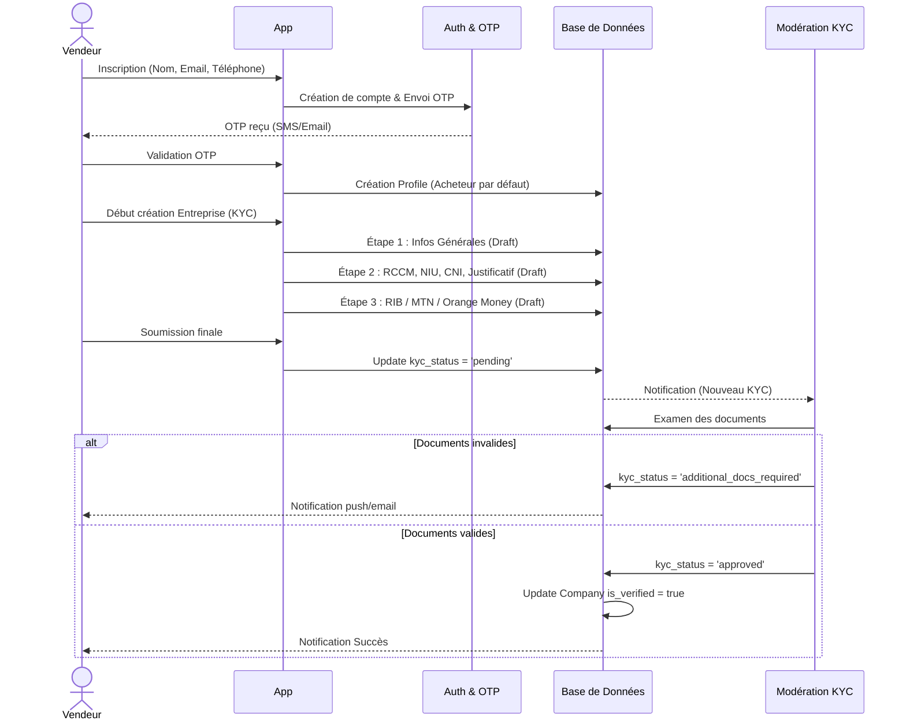
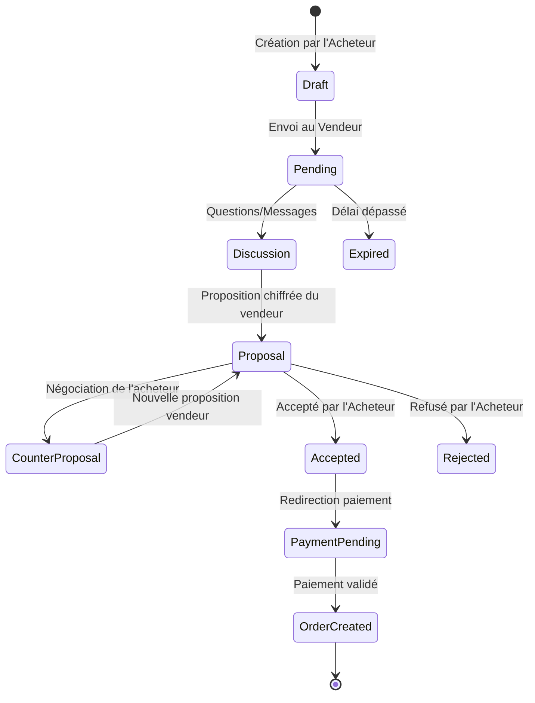
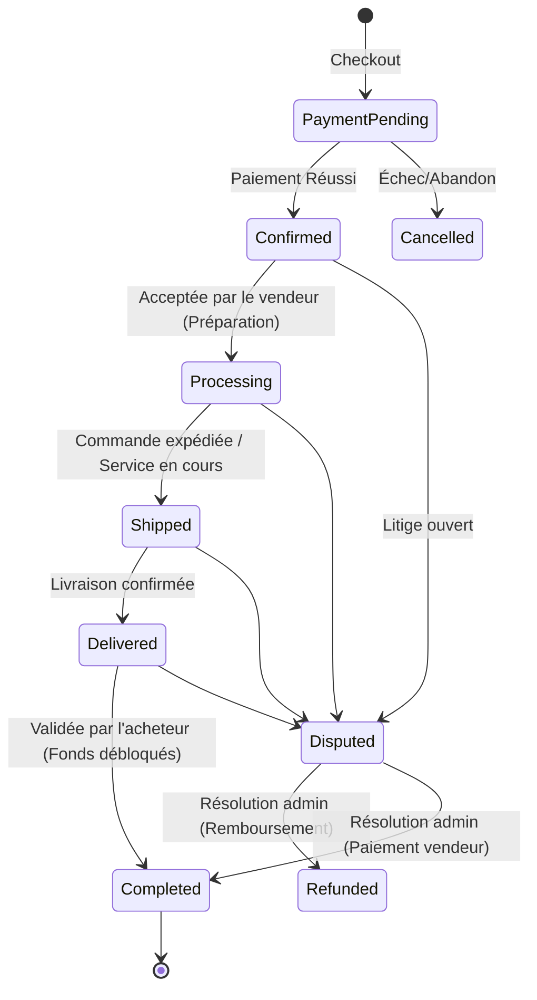
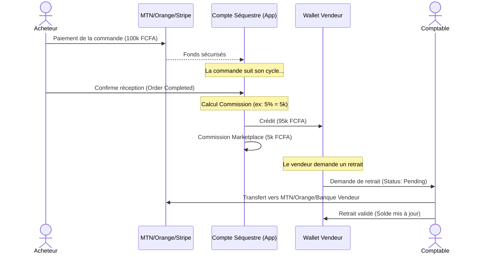

# VISUALIZ - ARCHITECTURE ENTERPRISE B2B/B2C

## 1. ANALYSE ET AMÉLIORATIONS (AUDIT DE L'EXISTANT)

### 1.1 Constat de l'existant
Mercaply fonctionnait jusqu'ici sur un modèle simplifié (B2C classique) sans distinction stricte entre la vente de **produits** (quantifiables, expédiables) et la vente de **services** (sur devis ou prix fixes, avec gestion de planning/portfolio).
Les processus critiques (KYC, flux de devis interactif, wallets, modération) manquaient de granularité pour passer à l'échelle.

### 1.2 Améliorations Architectoniques
1. **Unification du Compte Vendeur** : Une `Company` peut lister à la fois des produits physiques et des services immatériels.
2. **KYC as a State Machine** : Au lieu d'un simple booléen `is_verified`, le KYC devient une entité avec 6 états et des logs d'audit (brouillon -> en attente -> complément -> validé/rejeté/suspendu).
3. **Workflow Devis B2B (Quotes)** : Introduction d'un vrai cycle de négociation pour les services complexes.
4. **Gestion Financière (Wallet & Escrow)** : Le paiement de l'acheteur va sur un compte séquestre, le vendeur est crédité sur son wallet après validation de la commande, moins la commission automatisée.
5. **RBAC (Role-Based Access Control) Étendu** : 10 rôles granulaires au lieu de simplement Admin/User.

---

## 2. SYSTEME RBAC (ROLE-BASED ACCESS CONTROL)

- **Visiteur** : Navigation, Recherche, Visualisation de profils publics.
- **Acheteur** : Achats, Favoris, Devis (création), Avis, Messagerie.
- **Vendeur** : Un acheteur peut devenir vendeur via la création d'une entreprise (Company).
- **Entreprise** : L'entité légale. Détient les produits/services, les commandes, et le wallet.
- **Prestataire** : Un compte membre rattaché à une entreprise (pour la réalisation des services).
- **Support** : Accès au CRM, litiges, tickets, messagerie d'aide.
- **Modérateur** : Signalements, validation basique des fiches produits/services, avis.
- **Comptable** : Validation des retraits (payouts), consultation des transactions, commissions.
- **Administrateur** : Gestion des utilisateurs, validation du KYC (documents légaux), CMS.
- **Super Administrateur** : Configuration globale (règles métier, commissions, accès).

---

## 3. DIAGRAMMES DE SÉQUENCE & WORKFLOWS (MERMAID)

### 3.1. Workflow d'Inscription & KYC Vendeur

### 3.2. Cycle de vie d'un Devis B2B (Services sur devis)

### 3.3. Cycle de vie d'une Commande (Produit/Service fixe)

### 3.4. Workflow Financier (Wallets & Commissions)

---

## 4. REGLES METIER (BUSINESS RULES)

Toutes ces règles seront gérées dynamiquement via la table `settings` (Super Admin).

### 4.1. Configuration Financière
- **Commissions** : 
  - Globale par défaut (ex: 5%).
  - Surcharge par catégorie (ex: Électronique = 3%, Services IT = 10%).
  - Surcharge par abonnement Vendeur (ex: Premium = 2%).
- **Délais de paiement / Payouts** : 
  - Validation automatique d'une commande livrée si pas de réclamation après *N* jours (ex: 3 jours).
  - Délais de virement (Payout) : Immédiat via Mobile Money, J+2 via Banque.

### 4.2. Configuration Devis (Quotes)
- **Expiration** : Un devis en statut `pending` expire après 7 jours sans réponse du vendeur.
- **Engagement** : L'acceptation d'un devis génère automatiquement une facture pro-forma. Le délai de paiement maximum après acceptation est configurable (ex: 48h).

### 4.3. Modération & Sécurité
- **Quota d'annonces** : Non-vérifié = 5 articles max. KYC Vérifié = Illimité.
- **Suspension automatique** : 
  - Vendeur suspendu si le taux d'annulation dépasse 15% sur les 30 derniers jours.
  - Vendeur suspendu si le temps de réponse moyen dépasse 48h.
- **Avis** : Seuls les acheteurs ayant une commande au statut `completed` peuvent laisser un avis (Verified Purchase).

### 4.4. Messagerie & Notifications
- Interdiction stricte de partager des numéros de téléphone/emails dans la messagerie avant la commande (Détecté par RegEx et masqué).
- Toute action (Changement de statut commande, Message, Devis, Retrait, Signalement) déclenche :
  - Une notification In-App (table `notifications`).
  - Un email transactionnel.
  - Un push Firebase.

---

## 5. ARCHITECTURE DE DONNÉES (RAPPEL DES ENTITÉS CRÉÉES)

- **`companies`** : Profil entreprise riche (Bannière, Réseaux, KYC ref, Stats).
- **`kyc_requests` & `kyc_reviews`** : Workflow d'audit et historique.
- **`products` & `services`** : Séparation logique avec gestion des variantes, MOQ, packages, et sur devis.
- **`quotes` & `quote_messages`** : Moteur de négociation B2B.
- **`orders` & `order_items`** : Commande unifiée pouvant contenir des produits et/ou des services.
- **`wallets`, `transactions`, `withdrawals`** : Moteur de comptabilité en partie double.
- **`conversations` & `messages`** : Chat temps réel avec support PJ.
- **`tickets`, `reports`, `reviews`** : Service client, modération, et réputation.

## 6. PROCHAINES ÉTAPES (DÉVELOPPEMENT CODE)

L'audit logique étant validé et les diagrammes formalisés, la base de données actuelle (via `00004_enterprise_architecture.sql`) supporte déjà 95% de cette vision.
Le développement Frontend Next.js / React 19 va consister à :
1. Déployer les formulaires de création Entreprise et l'assistant KYC.
2. Développer l'interface Devis (Workflow Acheteur/Vendeur).
3. Connecter les Dashboards (Admin / Vendeur / Acheteur) aux nouveaux états de ces tables.
